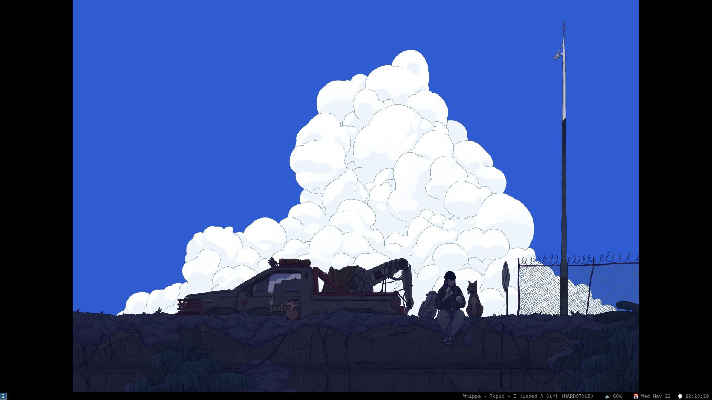

# Dotfiles

  

(from [hyperland-dots](https://github.com/linuxmobile/hyprland-dots/))

## Needed things

* alacritty
* dunst
* hypr
* rofi
* waybar

Font:
* "JetBrains Mono" (https://www.jetbrains.com/fr-fr/lp/mono/)

Theme:
* Catppuccin-mocha (https://github.com/catppuccin/catppuccin)
